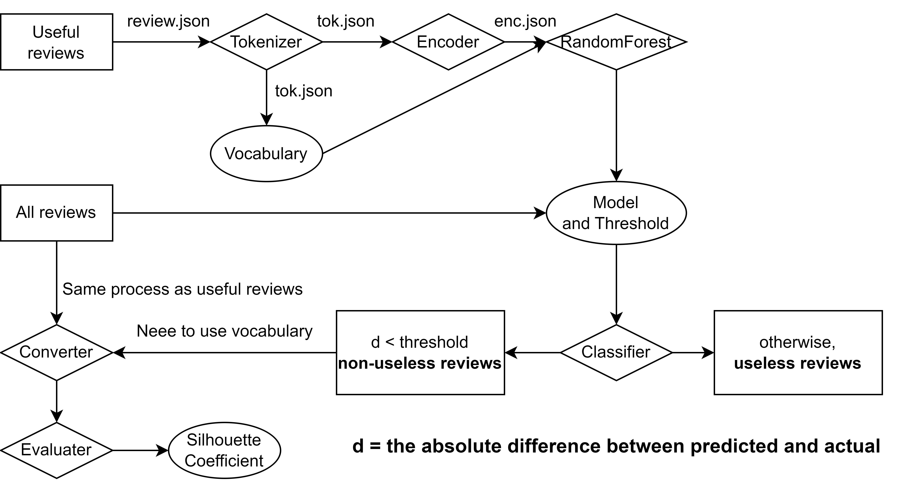

<a id="readme-top"></a>

<h1 align="center">Yelp Review Classifier</h1>

### Name:Yuao Ai  
### SUID: 258527763


<!-- ABOUT THE PROJECT -->
## About The Project


#### Perform the following: 
The flowchart for my project is shown below.  




### Acknowledgements and References
#### Dataset
* [Yelp Dataset](https://www.yelp.com/dataset)

#### Preprocessing
* [Text Preprocessing Blog](https://thedatafrog.com/en/articles/text-preprocessing-machine-learning-yelp/) form Colin Bernet


<!-- GETTING STARTED -->
## Getting Started

This is a guide of how to set up my project locally.


### Prerequisites

These are the python libraries that you need to install first.
#### * pytables
  ```sh
    pip install tables
  ```
#### * Downgrade numpy to a compatible version
  ```sh
    pip install numpy==1.23.5
  ```
#### * pandas
  ```sh
    pip install pandas
  ```
#### * nltk
  ```sh
    pip install nltk
  ```

#### * h5py
  ```sh
    pip install h5py
  ```
#### * sklearn
  ```sh
    pip install scikit-learn
  ```

  Assume you have already installed Python 3.6+ and pip. If not, please install them first.

### Installation

_Below is an example of how you can instruct your audience on installing and setting up your app. This template doesn't rely on any external dependencies or services._

1. Download dataset at [Yelp Dataset](https://www.yelp.com/dataset) and put it in `dataset/` 
2.  Enjoy!
<p align="right">(<a href="#readme-top">back to top</a>)</p>

## Usage
For this project, I originally planned to write a Makefile to complete everything in one step.
However, considering the Windows platform and the differences in commands, that approach proved difficult.
Nevertheless, you can still complete the process step by step by following the instructions below.

### Execute step by step
Of course, you can also complete this task step by step.
#### 1. Get Tokenized dataset:
**1.1 For all dataset:**
 ```sh
  python Tokenize.py -d "dataset" 'yelp_review.json' -l 1000000
 ```  
This takes only one input file, yelp_review.json, and reads 1000000 lines from this file in a single process.     

**1.2 For training set:**
 ```sh
  python Tokenize.py -d "dataset" 'yelp_useful.json' -l 500000
 ```


#### 2. Build the vocabulary
**2.1 For all dataset:**
  ```sh
  python VocabularyBuilder.py -d "dataset" 'yelp_review_tok.json' -p 
  ```
**2.2 For training dataset:**
  ```sh
  python VocabularyBuilder.py -d "dataset" 'yelp_useful_tok.json' -p 
  ```
#### 3. Encode the dataset
**3.1 For all dataset:**
  ```sh
  python Encoder.py -d "dataset" 'yelp_review_tok.json' -p 
  ```
**3.2 For training dataset:**
  ```sh
  python Encoder.py -d "dataset" 'yelp_useful_tok.json' -p 
  ```

**3.3 For non-useless dataset:**
  ```sh
  python Encoder.py -d "dataset" 'non_useless_reviews.json' -p 
  ```
This step will generate encoded files for each review token.
#### 4. Converte the encoded dataset to a numpy array
**4.1 For all dataset:**
  ```sh
  python NpArrayConverter.py  -d "dataset" 'yelp_review_tok_enc.json'  
  ```
**4.2 For training dataset:**
  ```sh
  python NpArrayConverter.py  -d "dataset" 'yelp_useful_tok_enc.json'  
  ```
**4.3 For non-useless dataset:**
  ```sh
  python NpArrayConverter.py  -o data_non_u.h5 -d "dataset" 'non_useless_reviews_enc.json'  
  ```
### Detailed Steps
1. Tokenized the training dataset by  executing 1.2
2. Build  the vovabulary by executing 2.2
3. Encode the training dataset by executing 3.2
4.  Train the model by executing "Trainer.py" and record threshold.
5. Re-do Step **1 - 3** but use "all dataset".
6. Convert the all dataset by executing 4.1
7. Classify the  reviews by executing "Classifier.py"
8. Re-do Step **1 - 3** but use "non-useless dataset".
9. Convert the  non-useless dataset by executing 4.3
10. Calculate the  silhouette coefficient by executing "Evaluater.py"   
*Warning: this step takes a long time!*


## Needed files
The files that are needed to use for training and evaluating are in "dataset/"
<table>
  <tr>
    <th colspan="2" align="center">Needed files list</th>
  </tr>
  <tr>
    <th align="center"><strong>Content</strong></th>
    <th align="center"><strong>File Name</strong></th>
  </tr>
  <tr>
    <td align="center">All dataset</td>
    <td align="center">yelp_review.json</td>
  </tr>
  <tr>
    <td align="center">Useful dataset</td>
    <td align="center">yelp.useful.json</td>
  </tr>
 <tr>
    <td align="center">Encoded all dataset's array</td>
    <td align="center">data.h5</td>
  </tr>
  <tr>
    <td align="center">Encoded non-useless array</td>
    <td align="center">data_non_u.h5.json</td>
  </tr>
</table>

The remaining files are generated only as intermediate outputs.   
*If you accidentally delete useful reviews, you can regenerate it using `UsefulReviewFilter.py`.*

## Contact

Aya -  yai104@syr.edu


